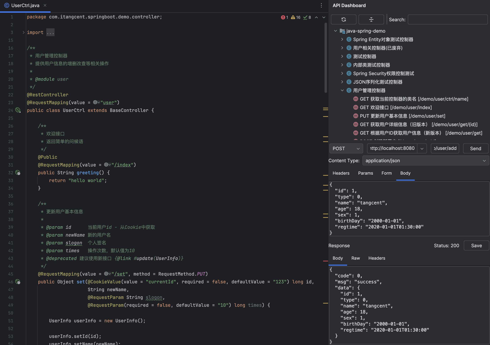

# Call API - IDE 内置 API 调试工具

## 功能简介

Call API 是一个轻量级的 API 调试工具，直接集成在 IDE 中，让您无需切换到外部应用即可快速测试和调试 API。它提供了简洁的界面和便捷的操作流程，特别适合开发过程中的日常 API 调试需求。

- **适用场景**：日常开发中的快速 API 测试和调试
- **优势**：无需切换到外部工具，直接在 IDE 中完成调试
- **定位**：针对开发流程中的快速验证；对于需要更复杂测试场景，可考虑使用 [导出到 Postman](/documents/export2postman.html) 功能

## 使用方法

1. 打开项目中包含 API 的文件
2. 右键点击文件内容，选择 `Call Api`
3. 在API窗口中编辑请求参数、发送 API 请求

## 功能特点

- **自动登录**：通过 [http.call.before](/setting/rules/http_call_before.html) 规则配置实现自动登录
- **响应处理**：通过 [http.call.after](/setting/rules/http_call_after.html) 规则配置实现响应数据的后处理
- **无缝集成**：与 IDE 完美集成，提供流畅的开发体验

## 使用建议

- 适合开发过程中需要快速验证 API 响应的场景
- 对于需要保存测试用例、创建测试集合或构建复杂测试流程的场景，可使用 [API 导出功能](/documents/export2postman.html)
- 配合 [规则配置](/setting/config-rule.html) 使用，可以实现自动化的测试流程和数据处理

---

## Call 相关规则配置

| 规则的 key | 规则目标(上下文) | 版本 | 规则描述 |
| ------------ | ------------ | ------------ |------------ |
| [http.call.before](/setting/rules/http_call_before.html) | request | v1.9.0+ | HTTP 请求前回调，可用于自动登录、添加通用请求头等 |
| [http.call.after](/setting/rules/http_call_after.html) | request&response | v1.9.0+ | HTTP 请求后回调，可用于响应数据处理、日志记录等 |

点击 [规则配置](/setting/config-rule.html) 查看更多配置选项。
