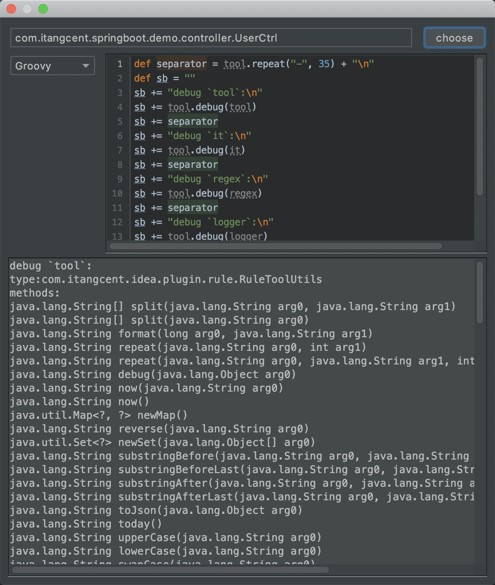

**Debug**

- 鼠标点击最上方<kbd>Code</kbd> > <kbd>Debug</kbd>, 将会打开脚本调试界面
    


---

- 点击`choose`选择调试对象
- 左边选择调试脚本类型,具体可用类型视`JDK`支持情况:一般有`Groovy`/`JavaScript`/`General`
- 脚本停止输入`3s`左右自动执行,并将执行结果显示在下方
- 插件提供的工具/对象: [tools](/setting/tools.html)

---

调试对象默认选中的是`class`
如果需要调试其他对象可以尝试在脚本头部重新对`it`赋值.

例如需要对`method`的调试可以尝试如下:

```groovy
//切换上下文,应用对象`it`现在是类中的第一个方法
it = it.methods()[0]

//现在可以尝试写以`method`为应用对象的脚本
def separator = tool.repeat("-", 35) + "\n\n"
def sb = ""
sb += "debug `tool`:\n"
sb += tool.debug(tool)
sb += separator
sb += "debug `it`:\n"
sb += tool.debug(it)
```