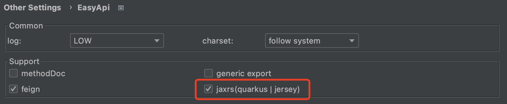

## 插件支持`JAX-RS`协议

- [quarkus](https://quarkus.io/)
- [jersey](https://eclipse-ee4j.github.io/jersey/)

### 确认勾选:<kbd>Preferences(Settings)</kbd> > <kbd>Other Settings</kbd> > <kbd>EasyApi</kbd> > <kbd>Support</kbd> > <kbd>jaxrs(quarkus | jersey)</kbd>

